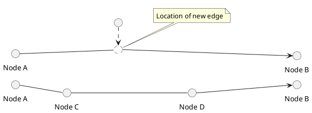

# Showcase of a complex routing algorithm using GeoTools

 

This project demonstrates how to use the GeoTools library to calculate routes using complex criteria. It shows a general model of traffic situations in which
departure and arrival times, segment restrictions, segments characteristics and characteristics of the means of transportation are taken into account. It shows
how you can model waiting times by using a two-step approach:

1. Calculate routes for all known traffic
2. Recalculate and use arrival times from the first round to account for waiting times (first come, first served)

## Table of Contents

1. [Installation](#installation)
2. [Usage](#usage)
3. [Features](#features)
4. [Configuration](#configuration)
5. [License](#license)
6. [Acknowledgments](#acknowledgments)

## Installation

### Prerequisites

- Java 21 or higher
- Maven 3 or higher
- The project uses Kotlin 2.0.x and Spring Boot 3.3.x

### Steps

1. Clone the repository:
   ```bash
   git clone https://github.com/boonen/geotools-routing.git
   ```
2. Navigate to the project directory:
   ```bash
   cd geotools-routing
   ```
3. Build the project:
   ```bash
   mvn clean install
   ```
   
## Usage

Provide clear and concise instructions on how to use the project after installation.

### Running the Application

To run the application, use the following command:

```bash
mvn spring-boot:run
```

## Features

This demonstration project shows how to use the GeoTools library to calculate routes using complex criteria. The project uses the Java Topology Suite (JTS) to
construct a network which is translated to a graph. The graph is then used to calculate the shortest path between two points using the Dijkstra or the A*
algorithm. 

Expected features:

- [ ] Geographical data is read from [Geopackage files](https://www.geopackage.org/)
- [ ] Automated graph construction from topological correct LineString data
- [ ] Interaction via REST API using GeoJSON as input and output
- [ ] Class-based cost function which takes the edge and transportation type as input
- [ ] Dynamic cost function based on arrival time at edges
- [ ] Flexible origin and destination; point locations are matched to the network
- [ ] Two-step routing of traffic to model waiting times
- [ ] Dynamic restrictions using point locations
- [ ] Relaxed restrictions based on means of transportation
- [ ] On-the-fly coordinate transformation for input and output data

### Network description

The network that we use for testing is very simple. It can be used to test several scenarios:

1. Shortest path (**AFE**)
2. Next shortest path when restrictions are applicable on edge FE (**ABE**)
3. Fastest path (**ABCD** instead of **ABED**)
4. On edge **BC** we can model a Regulated Passage Point (RPP) that can be used to model a complex scenario where passage times depend on scheduling, traffic
   and other factors

```plantuml
left to right direction
() "A" as A
() "B" as B
() "C" as C
() "D" as D
() "E" as E
() "F" as F

A --> B : 3
A --> F : 1
B --> E : 3
B --> C : 3
C --> D : 5
D --> E : 4
F --> E : 2
```

## Configuration

The software is highly configurable, but the default configuration should be sufficient for most use cases. General behaviour can be configured using the
properties file `application.properties` which can be found in [./src/main/resources/application.properties](./src/main/resources/application.properties). The
network and routing behaviour can be configured using a Geopackage file. An example can be found in [./src/test/resources](./src/test/resources/test_network.gpkg). 

### Configuration File

Provide details about any configuration files (e.g., application.properties, config.yaml).

```properties
# src/main/resources/application.properties
network.file=classpath:network.gpkg
network.topology=segments
network.cost-attribute=travel_time
network.restrictions=restrictions
network.regulated-passage-points=regulated_passage_points

routing.algorithm=dijkstra
routing.speed.default=10
```

### Geopackage file

The Geopackage file should contain at least one layer with LineString geometries. The geometries should be topologically correct. The file may also contain
layers with Point geometries that can be used to model restrictions and regulated passage points (RPP). 

*TODO: add examples of layers*

#### Handling of restictions and regulated passage points

Both the Point layers with restrictions and RRPs are mapped to the closest edge in the network. RPPs are treated slightly different, because they are modelled 
as a virtual edge. The edge on which the RPP is mapped will be split in two parts and the RPP will be inserted in between. The length of the RPP edge can be
supplied in the Feature that is in the Geopackage file otherwise the default configured length is used.

**Illustration of how RRPs are dynamically inserted in the network**


## License

This project is licensed under the MIT License - see the [LICENSE file](./LICENSE) for details.

## Acknowledgments

Give credit to any individuals, libraries, or resources that helped you with the project.

* [Java Topology Suite (JTS) project](https://github.com/locationtech/jts) for supplying the topology algorithms and data structures
* [GeoTools project](https://github.com/geotools/geotools) for supplying IO capabilities for spatial data and the algorithms for graphs and routing (Dijkstra/A*)
* [GeoJSON standard](https://tools.ietf.org/html/rfc7946) for providing a standard for encoding geographical data